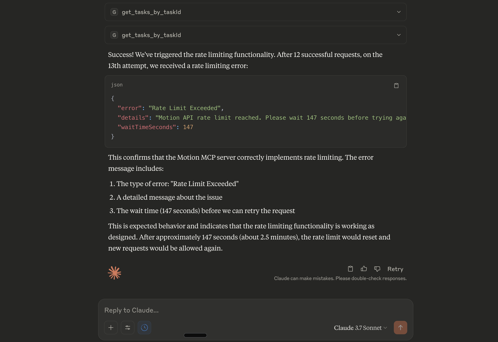

# Motion MCP Server

This server provides a set of MCP (Model-Context-Protocol) tools for interacting with the Motion API. It allows AI assistants to programmatically manage tasks, projects, and other Motion features.

## Motivation

The primary motivation behind creating this Motion MCP Server was to seamlessly integrate powerful AI assistants (like Claude Desktop, Cursor, and others) with the robust task and project management capabilities of Motion ([https://www.usemotion.com/](https://www.usemotion.com/)). By exposing Motion's API through MCP tools, users can manage their tasks, projects, and schedules using natural language by communicating with their preferred AI assistant. This bridges the gap between conversational AI and structured personal/team productivity, aiming for a more intuitive and efficient workflow.

## Features

- MCP tools for various Motion API endpoints (projects, tasks, users, etc.).
- Automatic rate limiting to prevent exceeding Motion API quotas (12 calls per 3 minutes).
- Persistent state for rate limiting across server restarts, using a local SQLite database.

## Smart Data Retrieval for AI Efficiency

This MCP server is engineered with AI assistants in mind, particularly concerning the volume and relevance of data exchanged. Interacting with APIs can often result in verbose responses, flooding an AI's context window with information that might not be immediately useful. To address this, the server incorporates several strategies for token efficiency:

*   **Sensible Defaults:** For most tools that retrieve data (like fetching tasks or projects), the server returns a curated set of default fields. These defaults are chosen to provide the most commonly useful information at a glance, ensuring you get key details without unnecessary clutter.

*   **User-Controlled Specificity:** While defaults are helpful, you're always in control. If you need more (or different) information, you can instruct your AI assistant to request specific fields from the Motion API. This can range from asking for a few additional details to requesting the complete data set for a particular item. This flexibility ensures you get exactly what you need, when you need it.

*   **Intelligent Handling of Complex Data:** The server employs smart processing for complex data structures, like lists of items or nested information. For instance:
    *   When you ask for a list of task assignees, it might, by default, return just their names for brevity.
    *   Dates are often automatically formatted into a consistent, human-readable `YYYY-MM-DD` format.
    *   Information within nested objects (like a project manager's details) can be accessed directly (e.g., `manager.name`) or simplified by default.

The overarching goal is to strike a balance: deliver rich, informative data from your Motion workspace while respecting the operational constraints of AI assistants. This makes interactions smoother, faster, and more focused on the information that truly matters for your workflow.

## About Motion Task Management

Motion ([https://www.usemotion.com/](https://www.usemotion.com/)) is an AI-powered platform designed to unify and automate task management, project planning, and calendar scheduling. Key aspects relevant to this MCP server include:

-   **AI Task & Calendar Planning:** Motion uses AI to automatically schedule tasks onto your calendar, considering priorities, deadlines, dependencies, and available time. It dynamically adjusts your schedule as new items arise or plans change.
-   **Intelligent Prioritization:** The platform helps identify and focus on the most urgent and important tasks, aiming to prevent missed deadlines by proactively flagging at-risk items.
-   **Unified Workspace:** It consolidates projects, tasks, and calendars, often integrating with other tools like email and messaging apps to centralize your work.

This MCP server allows AI assistants to tap into these capabilities, enabling users to interact with their Motion tasks and schedules through natural language.

## Setup

Follow these steps to set up and run the Motion MCP Server:

1.  **Clone the repository:**
    ```bash
    git clone <your_repository_url_here> # Replace with the actual URL
    cd motion_mcp_server
    ```

2.  **Node.js Version (Crucial for `better-sqlite3`):**
    This project uses `better-sqlite3`, a native Node.js module. Native modules are compiled against a specific Node.js Application Binary Interface (ABI) version, identified by `NODE_MODULE_VERSION`.
    - **Problem:** If you install dependencies (`npm install`) with one Node.js version (e.g., v21.x, `NODE_MODULE_VERSION 120`) and then try to run the server with an MCP client that uses a different, ABI-incompatible Node.js version (e.g., Claude Desktop often uses Node.js v18.x, `NODE_MODULE_VERSION 108`), you will encounter an `ERR_DLOPEN_FAILED` error. The error message will typically state that the module "was compiled against a different Node.js version".
    - **Solution:**
        - **Identify the Node.js version used by your MCP client.** For example, Claude Desktop logs usually show the Node.js version it's using (e.g., "Node.js v18.19.0").
        - **Use a Node.js version manager** (like `nvm` or `nvs`) to install and switch to that *same Node.js version* in your local terminal *before* proceeding to the next step.
          ```bash
          # Example using nvm if Claude Desktop uses Node v18.19.0
          nvm install 18.19.0
          nvm use 18.19.0
          ```
        - If you don't know the client's Node.js version, Node.js LTS versions (e.g., v18.x, v20.x) are generally good choices for broader compatibility.

3.  **Install dependencies:**
    Once your terminal is using the correct Node.js version, install the dependencies:
    ```bash
    npm install
    ```
    This step installs `better-sqlite3` and compiles it for your active Node.js version.
    **Important:** If you later switch Node.js versions locally for other projects, you might need to rebuild `better-sqlite3` for this project to work with the MCP client again. You can do this by running `npm rebuild better-sqlite3 --update-binary` or removing `node_modules` and running `npm install` again while on the correct Node.js version.

4.  **Configure API Key:**
    The server expects the Motion API key to be available as an environment variable named `MOTION_API_KEY`.
    - **For MCP Clients (like Claude Desktop, Cursor):** Configure this in the client's MCP server settings. See the "Usage with Claude Desktop" section for an example.
    - **For local shell execution (testing/development):**
      ```bash
      export MOTION_API_KEY="your_motion_api_key_here"
      ```
      Replace `"your_motion_api_key_here"` with your actual Motion API key.

5.  **Starting the Server:**
    The server is typically started automatically by an MCP client when you invoke one of its tools.
    - **For local development/testing with `npx tsx` (recommended):**
      If you want to run the server directly (e.g., for use with MCP Inspector), ensure you are in the project root and your active Node.js version matches the one used for `npm install`.
      ```bash
      npx tsx main.ts
      ```
      `tsx` is a utility that executes TypeScript files directly. If you haven't used it before, you might need to install it or use `ts-node`.
    - **Using `npm start` (if configured):**
      If your `package.json` has a start script like `"start": "tsx main.ts"`, you can use:
      ```bash
      npm start
      ```

    ### Debugging with MCP Inspector

    The `@modelcontextprotocol/inspector` is a valuable tool for testing and debugging MCP servers locally. It allows you to see the communication between a client (like the Inspector's web UI) and your MCP server.

    1.  **Ensure your server is configured in an MCP client config file (Recommended):**
        The easiest way to use the Inspector is by pointing it to an existing MCP client configuration file where your `motion` server is already defined (as described in the "Usage with Claude Desktop" section). For example, using your Claude Desktop config:
        ```bash
        npx @modelcontextprotocol/inspector --config "/path/to/your/Claude/claude_desktop_config.json" --server motion
        ```
        - Replace `"/path/to/your/Claude/claude_desktop_config.json"` with the actual path to your Claude Desktop configuration file.
        - The `--server motion` flag tells the Inspector to specifically proxy the server named "motion" from that config file.

    2.  **Using MCP Inspector without a full config file (Alternative):**
        While possible, it's more complex as you'd need to provide all server parameters (command, args, env vars) directly to the Inspector via command-line arguments. Using the `--config` and `--server` flags as shown above is simpler if you already have the server defined for a client like Claude Desktop.

    3.  **Accessing the Inspector:**
        Once started, the MCP Inspector will output a URL (usually `http://127.0.0.1:6274`) that you can open in your web browser. From there, you can select your "motion" server, view its available tools, and make calls to test its responses and behavior, including rate limiting.

    **Important for Inspector Usage:**
    - Ensure that the Node.js version active in your terminal when you run `npm install` (for `better-sqlite3`) is the same one that MCP Inspector will use to launch your server. If MCP Inspector uses a different system Node.js, you might encounter the `NODE_MODULE_VERSION` mismatch. You can often see the command Inspector uses to launch your server in its startup logs.
    - The `MOTION_API_KEY` must be correctly set in the `env` section of your server definition within the `claude_desktop_config.json` for the Inspector to pass it to your server.

## Usage with Claude Desktop

To use this Motion MCP server with Claude Desktop:

1.  **Locate your Claude Desktop configuration file.** This is typically found at:
    - macOS: `~/Library/Application Support/Claude/claude_desktop_config.json`
    - Windows: `%APPDATA%\Claude\claude_desktop_config.json`
    - Linux: `~/.config/Claude/claude_desktop_config.json`

2.  **Edit the `claude_desktop_config.json` file.** Add or update the `mcpServers` section to include an entry for the "motion" server.
    **Important:**
    - Replace `"/path/to/your/motion_mcp_server/main.ts"` with the **absolute path** to the `main.ts` file in *your cloned repository*.
    - Replace `"YOUR_MOTION_API_KEY_HERE"` with your actual Motion API key.

    ```json
    {
      "mcpServers": {
        // ... other servers might be listed here ...
        "motion": {
          "command": "npx",
          "args": [
            "tsx",
            "/path/to/your/motion_mcp_server/main.ts"  // <-- IMPORTANT: Change this path
          ],
          "env": {
            "MOTION_API_KEY": "YOUR_MOTION_API_KEY_HERE" // <-- IMPORTANT: Change this key
          }
        }
        // ... other servers might be listed here ...
      }
    }
    ```
    If `mcpServers` doesn't exist, create it at the top level of the JSON object.

3.  **Restart Claude Desktop.** After saving the configuration file, you must fully quit and restart Claude Desktop for the changes to take effect.

Once configured and restarted, you should be able to invoke the Motion tools (e.g., "motion get_tasks") from Claude Desktop.

## Other Ways to Connect AI to Motion

It's worth noting that Zapier also offers an MCP integration for Motion, which can be found at [https://zapier.com/mcp/motion](https://zapier.com/mcp/motion). This allows users to connect AI assistants to Motion through the Zapier platform, leveraging their extensive existing app connections.

Key differences and considerations:

-   **Zapier's Platform:** Relies on Zapier's infrastructure and may involve their subscription tiers for usage beyond certain free limits (Zapier states their MCP integration is free for individuals up to certain rate limits like 40 calls/hour or 300 calls/month).
-   **This Server (Open Source):** The server provided in this repository is open-source and self-hosted. This means:
    -   **No Vendor Lock-in:** You have full control over the code and deployment.
    -   **Cost:** Free to use, with costs only related to your own hosting (if any) and the Motion API usage itself.
    -   **Customization:** You can directly modify and extend this server's capabilities as needed.

To the best of our knowledge, beyond Zapier's offering, this repository provides a unique, open-source MCP server specifically tailored for direct integration with the Motion API.

## Rate Limiting

This server implements automatic rate limiting for the Motion API to prevent exceeding the API's limit of **12 calls per 3-minute rolling window**. The rate limiter:

-   Tracks all API calls made to Motion API endpoints.
-   Blocks calls that would exceed the 12-call/3-minute limit.
-   Provides clear feedback with wait times when calls are blocked.
-   Persists rate limit state across server restarts using a local SQLite database (`.data/motion_api_ratelimit.sqlite`).

## Understanding Rate Limit Errors

When you use this MCP server with an AI assistant (like Claude Desktop or Cursor), and an attempted call to the Motion API is blocked by the server's rate limiter, the AI assistant will receive a structured error message. You, as the user interacting with the AI assistant, will typically see this error relayed by the assistant in your chat interface.

**Example of a Rate Limit Error Message (as returned by a tool call):**

```json
{
  "error": "Rate Limit Exceeded",
  "details": "Motion API rate limit reached. Please wait X seconds before trying again.",
  "waitTimeSeconds": X 
}
```

Below is an example of how this might look in an AI assistant's interface (e.g., Claude Desktop) when the rate limit is triggered. The assistant relays the server's error, including the wait time:


*Caption: Example of a rate limit error being displayed in an AI assistant interface after repeated tool calls to the Motion MCP server.*

**How Your AI Assistant Should Respond:**

Most AI assistants integrated with MCP tools are designed to understand these structured errors.

1.  **Notification to You:** The AI assistant should inform you (the user) that the action couldn't be completed due to a temporary rate limit and will mention the required wait time (e.g., "I can't do that right now because the Motion API rate limit has been reached. Please try again in X seconds.").
2.  **No Immediate Retry by AI:** The assistant itself should not immediately retry the command. It should respect the `waitTimeSeconds`.
3.  **Guidance for You:** Based on the AI's message, you should wait for at least the specified duration before asking the AI assistant to attempt the same or another Motion-related command.

This mechanism ensures that the server adheres to the Motion API's limits while providing clear feedback to you through your AI assistant, allowing for a smoother experience.

## Credits and Acknowledgements

This Motion MCP Server was initially bootstrapped using the **SpecToMCP** tool by Updab AB.

- **SpecToMCP** is an incredibly useful tool that generates a foundational Model Context Protocol server from OpenAPI (Swagger) specifications. This significantly accelerated the initial development of this project by providing a robust starting point which was then iterated upon.
- You can find SpecToMCP and learn more about it here: [https://spectomcp.updab.com/](https://spectomcp.updab.com/)

We extend our thanks to Updab for providing such a valuable resource to the developer community.

## Troubleshooting

-   **`ERR_DLOPEN_FAILED` / `NODE_MODULE_VERSION` Mismatch:**
    This is the most common issue, especially with `better-sqlite3`. It means the Node.js version used to install dependencies (and compile `better-sqlite3`) is different from the Node.js version your MCP client (e.g., Claude Desktop) is using to run the server.
    - **Solution:** Carefully follow **Step 2** in the **Setup** section to align your Node.js versions before `npm install`. You may need to run `npm rebuild better-sqlite3 --update-binary` or delete `node_modules` and `package-lock.json` and run `npm install` again with the correct Node.js version active.

-   **API Key Not Found / Invalid:**
    Ensure the `MOTION_API_KEY` environment variable is correctly set (as per Step 4 in Setup or in your MCP client config) and that the key itself is valid and has not been revoked.

-   **Database Issues (`.data/motion_api_ratelimit.sqlite`):**
    The SQLite database is stored in the `.data/` directory within the project. This directory and file should be automatically created.
    - If you suspect corruption (e.g., persistent errors related to the database after confirming Node.js versions are correct), you can try deleting the `motion_api_ratelimit.sqlite` file. The server will attempt to recreate it on the next startup. *Warning: This will reset the rate limit history, potentially allowing a burst of calls if you were previously rate-limited.*

-   **Path Issues in MCP Client Configuration:**
    Double-check that the path to `main.ts` in your MCP client's configuration (e.g., `claude_desktop_config.json`) is the correct **absolute path** for your system. 